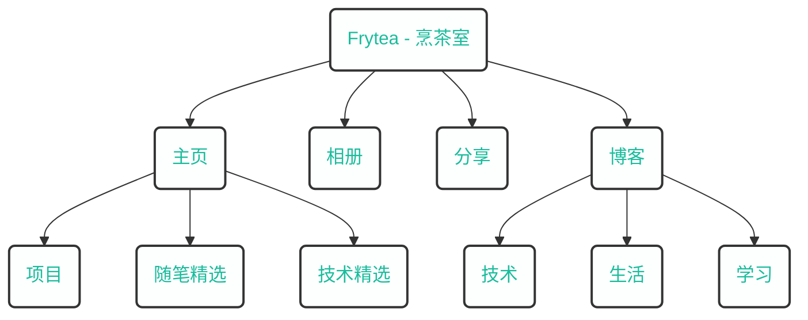

## 关于本站

煎茶[^1]，原创，优质、有深度、有思考的内容分享网站。

本章分享内容包括 Linux 生态技术栈、虚拟化、WEB开发、技术技巧以及生活记录、复盘等。 **质量为先，内容为王**。 希望为这个日益丰富的互联网世界贡献一份精彩内容，留下我的思考和成长足迹，见证这个美好的世界。

本站采用世界上最快的网站建设框架[^2] [hugo](https://gohugo.io/)，并基于一款极其高效的模版定制了本站样式。

[^1]: frytea.com
[^2]: [hugo](https://gohugo.io/),The world’s fastest framework for building websites. 

### 历史

- 2018.10.07, 开始建造我的世界，并拥有自己的第一个域名（songtianlun.cn）；
- 2018.11.12, 使用 WordPress 搭建自己的第一版博客；
- 2019.01.27, 拥有自己的第二个域名（frytea.com）；
- 2019.02.21, 开始使用 Hexo 搭建静态博客；
- 2019.07.17, 将博客内容重新整理汇总，开始使用 Typecho 渲染博客；
- 2019.08.17, Start build wiki, powered by Dokuwiki；
- 2019.11.19, 完成 `ICP` 备案, 备案号: `粤 ICP 备 19144283 号` ；
- 2021.10.22, 博客文章突破 423 篇；
- 2021.10.22, 本站正式加入 Google Adsense，但愿能摊平运营成本；
- 2021.10.26, 分析了现有网站的利弊之后，决定自己定制网站，使用 Hugo 引擎；
- 2021.10.27, 采用定制 PaperMod 主题的个人网站正式上线，要做的还有很多。
- 2021.11.03, 网站正式支持 [PWA](https://developer.mozilla.org/zh-CN/docs/Web/Progressive_web_apps) ，来试试吧！
- 2021.11.09, 本站正式签订[《十年之约》](https://www.foreverblog.cn)，与千名站长一起狂欢，保持独立原创网站更新和活力！

## 关于我

毕业于 **霍格沃茨魔法学校**，主修魔药学（Potions）、魔咒课（Charms）、黑魔法防御术（Defence Against the Dark Arts）、变形学（Transfiguration）。

一个有理想的 **程序员** ，职业 **技术人** ，不仅会写代码，还会写文章，对做产品很感兴趣。天生 **责任心极强** ，不仅为写过的代码负责，还关注写代码的 **原因和目的** ，代码为需求服务，致力于成为一名不仅仅会写代码的 **全能型** 选手。

在 [这里](https://www.overleaf.com/read/fntrwsvyfhny) 可以获取我的 LaTeX 个人简历。

## 联系方式

- Email：[songtianlun@frytea.com](mailto:songtianlun@frytea.com)
- Telegram: [@songtianlun](https://t.me/songtianlun)
- GitHub: [@songtianlun](https://github.com/songtianlun)
- Linked-in: [@songtianlun](https://www.linkedin.com/in/songtianlun/)
- V2EX: [@Frytea](https://www.v2ex.com/member/Frytea)
- 即刻: [@煎茶_frytea](https://web.okjike.com/u/93f05b30-c2af-4096-b90e-32961464b881)
- 知乎: [@煎茶frytea](https://www.zhihu.com/people/song-tian-lun-64)
- 少数派: [@frytea](https://sspai.com/u/frytea/)
