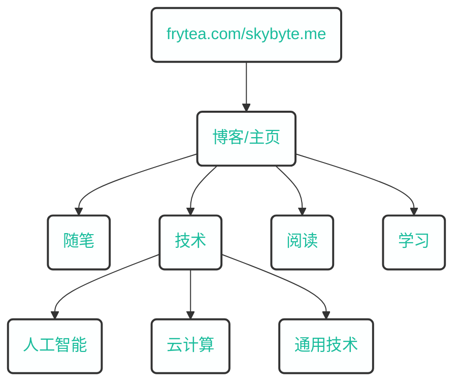

## 关于本站

煎茶[^1]，致力于打造原创，优质、有深度、有思考的内容分享网站。

本站采用世界上最快的网站建设框架[^2] [hugo](https://gohugo.io/)，基于 [PaperMod](https://github.com/adityatelange/hugo-PaperMod) 定制。

网站架构规划如下：

当前拥有两个域名：

- frytea.com: 个人主页及技术博客，境内备案；
- skybyte.me: 暂未备案。

注册新域名的原因是在一次服务器和域名续费之后，在想自己一直花钱做这些事情是否有价值。反思过后发现自己一直以来都有些本末倒置，网站最重要的应该是内容，而非形式。如果我再这样随心所欲下去，网站总有一天运营不下去，用爱发电是不会长久的。

至于盈利方式，为了支撑网站的长期运营，每个网站都有投放来自 Google Adsense 的广告，至今还未收过款，还需要继续努力。如果未来能够探索到其他盈利方式，我将考虑停止投放广告，但是目前只能保留。

[^1]: frytea.com
[^2]: [hugo](https://gohugo.io/),The world’s fastest framework for building websites. 

### 里程碑

- 2018.10.07，开始建造我的世界，并拥有自己的第一个域名（songtianlun.cn）
- 2019.01.27，拥有自己的第二个域名（frytea.com）
- 2019.11.19, 完成 `ICP` 备案, 备案号: `粤 ICP 备 19144283 号`
- 2021.11.09, 本站正式签订[《十年之约》](https://www.foreverblog.cn)，与千名站长一起狂欢，保持独立原创网站更新和活力！

> 以下内容写于 2023 年 5 月 4 日，前阵子经历了多次服务器宕机，主要是瞬间压力暴涨导致，查看服务器压力主要是 mysqld 占用最高。增加服务器配置成本过高，分析了自身状况，为了最低成本运营网站，以内容为本，采取一系列举措来去数据库，降低成本：
> - blog.frytea.com 所有内容转移到了本站，并做了 301 重定向。
> - 图床内容全部 301 到 images.skybyte.me，不再使用 CDN 。
> - 自用服务器尽量避免部署数据库，如必要尽量采用免费 DaaS 服务，除非商用。

## 关于我

这个不重要。

## 联系方式

- Email：[songtianlun@frytea.com](mailto:songtianlun@frytea.com)
- Telegram: [@songtianlun](https://t.me/songtianlun)
- GitHub: [@songtianlun](https://github.com/songtianlun)
- V2EX: [@Frytea](https://www.v2ex.com/member/Frytea)
- 即刻: [@煎茶_frytea](https://web.okjike.com/u/93f05b30-c2af-4096-b90e-32961464b881)
- 少数派: [@frytea](https://sspai.com/u/frytea/)
