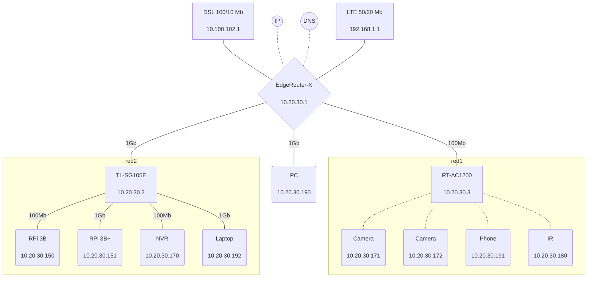

[mermaid](https://mermaid-js.github.io/mermaid/#/) 是一款 javascript 库，能够轻而易举地通过文本代码绘图。

作为普通用户，将其理解为一种绘图的语言即可，集成它之后就可以在 markdown 的轻松插入特定语法编写的各类图示了，而且不需要像 plantuml 一样需要外部服务器，目前 [notion](https://www.notion.so/) 、 [obsidian](https://obsidian.md/) 等都已原生支持该特性，许多博客主题也支持该语法。

使用它，可以轻松在各类 md 编辑器中绘图，方便修改和传播。

具体语法请查看 mermaid 官网，本文展示一些在互联网发现的比较优秀的示例：

## 网络拓扑图

## 参考文献

- [New diagram type: network topology #1227](https://github.com/mermaid-js/mermaid/issues/1227)
- [About Mermaid](https://mermaid-js.github.io/mermaid/#/?id=about-mermaid)

