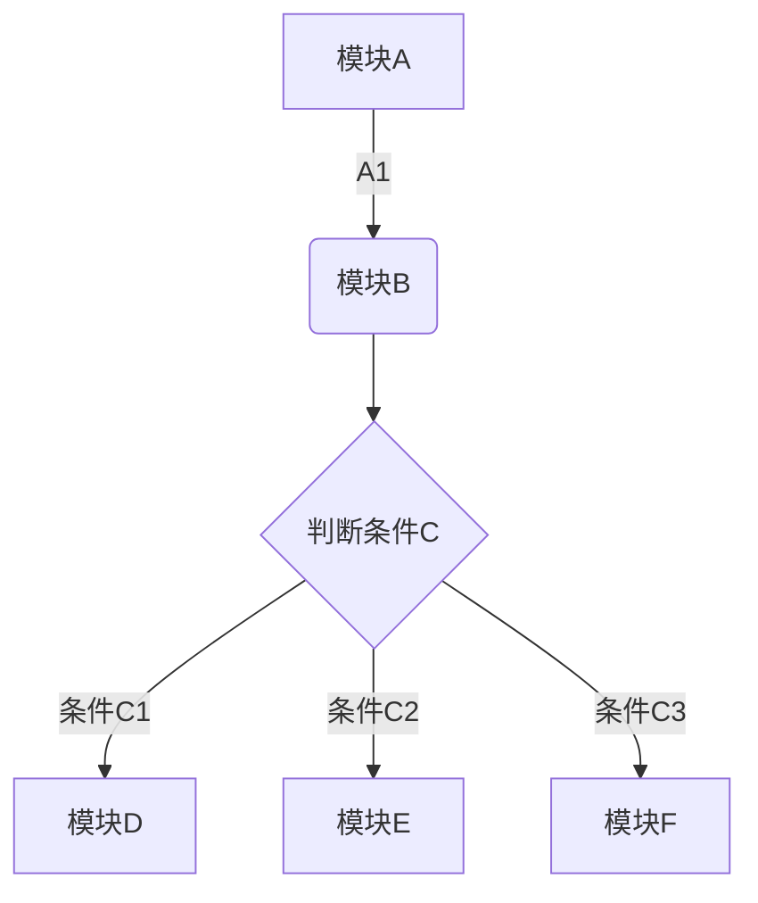
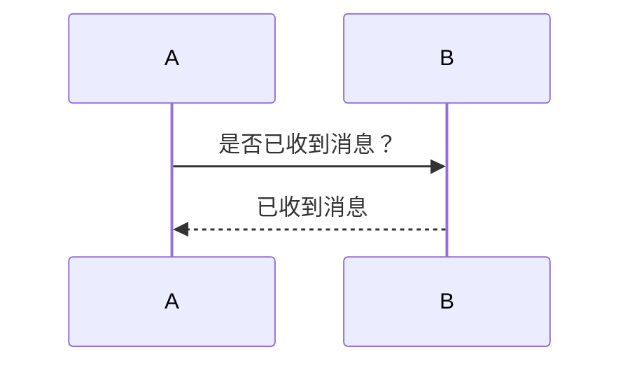
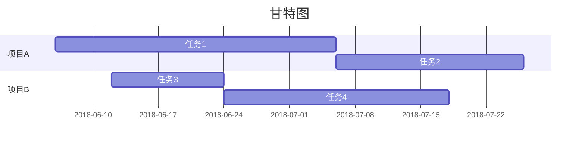

Markdown是一种可以使用普通文本编辑器编写的标记语言，通过简单的标记语法，它可以使普通文本内容具有一定的格式。因为其简单的语法及强大的拓展，可以让人专注于写作，不必要过于关注排版，是撰写文章的利器。

# 一、基础语法
首先介绍一些常用的 Markdown 语法，掌握这些语法就可以使用markdown撰写排版精美的文章了。

##（1）标题

# 一级标题
## 二级标题
### 三级标题
#### 四级标题
##### 五级标题
###### 六级标题

```markdown
# 一级标题
## 二级标题
### 三级标题
#### 四级标题
##### 五级标题
###### 六级标题
```

## （2）粗体、斜体、删除线和下划线

*斜体*
**粗体**
***加粗斜体***
~~删除线~~

```markdown
*斜体*
**粗体**
***加粗斜体***
~~删除线~~
```

## （3）引用块

 > 文字引用

```Markdown
 > 文字引用
```

## （4）代码块

`行内代码`
```
多行代码
多行代码
```

```Markdown
# `行内代码`
#
# ```
# 多行代码
# 多行代码
# ```
注：实际使用没有‘#’
```
## （5）分割线

方法一：

---

方法二：

***

```Markdown
方法一：---
方法二：***
```

## （6）列表项
1. 有序列表项
* 无序列表项
+ 无序列表项
- 无序列表项

```Markdown
1. 有序列表项
* 无序列表项
+ 无序列表项
- 无序列表项
```
## （7）任务清单
- [x] 任务
```Markdown
 - [x] 任务
```

## （8）表格

表头1 | 表头2 | 表头3
--: | :-- | :--: 
内容11 | 内容12 | 内容13
内容21 | 内容22 | 内容23

```Markdown
表头1 | 表头2 | 表头3
--: | :-- | :--: 
内容11 | 内容12 | 内容13
内容21 | 内容22 | 内容23
注：’:所在的位置为文字对齐方向’
```
## （9）超链接

[我的博客](https://songtianlun.github.io/ "我的博客")
<https://songtianlun.github.io>

```Markdown
方法一：[链接文字](链接地址 "链接描述")
例如：[我的博客](https://songtianlun.github.io/ "我的博客")
    
方法二：<链接地址>
例如：<https://songtianlun.github.io>
```

## （10）图片

```Markdown语法

例如：
```

# 二、进阶语法
markdown除了以上列出的基础语法，还提供了很多的扩展功能，这些功能并不是所有的markdown渲染器都支持，但却可以为markdown增色不少，下面开始介绍。

## （1）公式块 - Latex公式
举例：

$$x=\frac{-b\pm\sqrt{b^2-4ac}}{2a}$$
```
$$x=\frac{-b\pm\sqrt{b^2-4ac}}{2a}$$
```

$x=\frac{-b\pm\sqrt{b^2-4ac}}{2a}$
```
$x=\frac{-b\pm\sqrt{b^2-4ac}}{2a}$
```
### 基本用法
行间公式：$$公式$$
`$$公式$$`
行内公式：$公式$
`$公式$`
上标：$a^{2}$
 `$a^{2}$`
下标：$a_{2}$
`$a_{2}$`
上下标：$a^{i}_{j}$
`$a^{i}_{j}$`
分式：$\frac{dx}{dy}$
`$\frac{dx}{dy}$`
根式：$\sqrt[2]{pq}$   $\sqrt[\frac{2}{3}]{x^y}$
```
$$\sqrt[指数]{表达式}$$
$\sqrt[2]{pq}$ 
$\sqrt[\frac{2}{3}]{x^y}$
```
求和：$$\sum_{下限}^{上限}求和表达式$$ 
```
$$\sum_{下限}^{上限}求和表达式$$ 
$$\sum_{i=-\infty}^{i=+\infty}\frac{1}{x}dx$$
```
积分：$$\int_{0}^{1}\frac{1}{x}dx$$
```
$$\int_{下限}^{上限}积分表达式$$ 
$$\int_{0}^{1}\frac{1}{x}dx$$
```
矩阵：$$\begin{pmatrix}1 & 2\\3 &4\end{pmatrix}$$
$$\begin{pmatrix} 11 & 12 & ... & 1N \\ 21 & 22 & ... & 2N \\ ... & ... & ... & ... \\ N1 & N2 & ... & NN \end{pmatrix}$$
```
$$\begin{pmatrix}1 & 2\\3 &4\end{pmatrix}$$
$$\begin{pmatrix} 11 & 12 & ... & 1N \\ 21 & 22 & ... & 2N \\ ... & ... & ... & ... \\ N1 & N2 & ... & NN \end{pmatrix}$$
```
### 特殊符号


## （2）流程图


## （3）时序图


## （4）甘特图


## （5）图表
### 饼图
```chart
,Budget,Income,Expenses,Debt
June,5000,8000,4000,6000
July,3000,1000,4000,3000
Aug,5000,7000,6000,3000
Sep,7000,2000,3000,1000
Oct,6000,5000,4000,2000
Nov,4000,3000,5000,

type: pie
title: Monthly Revenue
x.title: Amount
y.title: Month
y.suffix: $
```

### 折线图
```chart
,Budget,Income,Expenses,Debt
June,5000,8000,4000,6000
July,3000,1000,4000,3000
Aug,5000,7000,6000,3000
Sep,7000,2000,3000,1000
Oct,6000,5000,4000,2000
Nov,4000,3000,5000,

type: line
title: Monthly Revenue
x.title: Amount
y.title: Month
y.suffix: $
```

### 柱状图
```chart
,Budget,Income,Expenses,Debt
June,5000,8000,4000,6000
July,3000,1000,4000,3000
Aug,5000,7000,6000,3000
Sep,7000,2000,3000,1000
Oct,6000,5000,4000,2000
Nov,4000,3000,5000,

type: column
title: Monthly Revenue
x.title: Amount
y.title: Month
y.suffix: $
```
### 横向柱状图
```chart
,Budget,Income,Expenses,Debt
June,5000,8000,4000,6000
July,3000,1000,4000,3000
Aug,5000,7000,6000,3000
Sep,7000,2000,3000,1000
Oct,6000,5000,4000,2000
Nov,4000,3000,5000,

type: bar
title: Monthly Revenue
x.title: Amount
y.title: Month
y.suffix: $
```

# 参考文献

- [Hexo撰写文章](https://blog.csdn.net/wsmrzx/article/details/81478945)
- [Markdown Latex公式总结](https://blog.csdn.net/sinat_33425327/article/details/82692120)
- [最全 Markdown + Latex 编写技巧](https://blog.csdn.net/HaleyPKU/article/details/80341932)
- [有LaTeX的深厚底蕴，Markdown是果然最美的编辑语言！！](https://www.jianshu.com/p/16fbd768bfe7)
